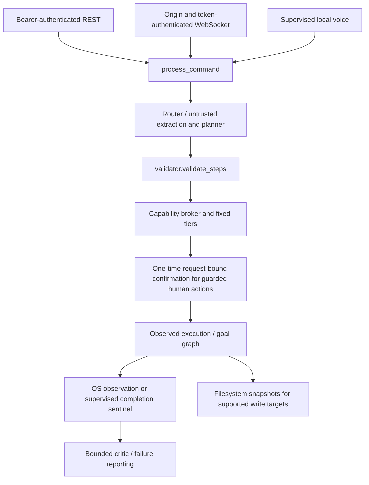

# Containment architecture

## Invariant

The language model is untrusted. It proposes a plan; deterministic code decides
whether that plan may execute. Model output must not expand permissions, edit policy,
change capability tiers, or substitute its own success assertion for an observation.

## Enforcement locations

| Mechanism | Source | Limitation |
|---|---|---|
| Intent/command/path filtering | `agentic_core/validator.py`, `config/constants.py` | Denylist/allowlist validation is not OS process isolation |
| Capability tiers and grants | `capability_broker.py`, `config/capability_tiers.py` | Direct-human and autonomous contexts have distinct policy |
| Human confirmation | `confirmation.py`, `api_wrapper.py` | In-memory, one-time, TTL-bound to prompt/plan; on by default |
| Resource budgets | `budget.py`, `config/budgets.py` | Bounds checked operations, not all OS resource consumption |
| Independent observation | `postcondition_observer.py`, `_derive_expected_state` | Only supported actions with a reliable fact are checked |
| Goal-graph dependencies and replanning | `api_wrapper.py`, `goal_graph.py`, `critic.py` | Bounded replans can still encounter uncertain side effects |
| Snapshot/restore | `snapshot.py`, supported write-target derivation | Partial filesystem recovery, not whole-machine rollback |
| Process completion | `process_supervisor.py` | Launch acknowledgement is not completion; a sentinel is stronger than PID disappearance |

## Execution authority

`execution_authority.py` validates the resolved action and derives its tier from
trusted policy immediately before dispatch. Request-local authority is immutable;
worker threads receive it explicitly. Callers without request authority are
considered autonomous. Initial execution, goal-graph replans, observation retries
and direct executor calls use this boundary.

Confirmation covers every executable field. Graph status and planner verification
hints do not confer authority. A guarded template whose arguments change during
data substitution cannot reuse its confirmation. Shell repairs and cached-path
replacements stop and require a new request. Arbitrary application paths and script
launches are T3; the small fixed application-name set retains T1.

Planner `expected_state` is retained only as a hint. The executor replaces it with
an action-derived predicate, or omits verification when no supported check exists.
The observer checks system state; it does not establish that this action caused it.

The boundary protects against untrusted model output. It is not a Python sandbox:
malicious code already imported into the service can call OS APIs directly.

## Process isolation

CodeAct requires Windows Sandbox. Missing Sandbox, failed launch or missing
completion instrumentation blocks execution; there is no host fallback. Only the
per-run folder is shared writable. Networking remains enabled. Windows Sandbox
availability depends on edition, optional features and resources; real operation
must be verified on the target machine.

npm installation requires Docker. Its selected workspace is a writable bind mount;
the rest of the host is not intentionally mounted. The container drops capabilities
and disallows privilege elevation, but network/package supply-chain trust remains.
Docker failure or incompatible Linux native modules produces failure, never a host
retry. Host pip installation is disabled pending a contained target-environment design.

Other desktop actions may run with the user's privileges. A path policy, snapshot,
human confirmation or process observer does not turn them into a complete sandbox.

## Observation and failure semantics

Supported observations include process appearance/absence, path existence/absence,
window state/title, generated artifact patterns and scheduler state. Derivation is
action-specific: e.g. general OS commands do not acquire invented postconditions.
Conversational/read-only outputs and some UI actions leave no durable fact. Async
CodeAct/dependency installs use supervised completion rather than an immediate
synchronous postcondition. Report these distinctions explicitly.

REST and streaming commands enter the same pipeline. The streaming adapter forwards
confirmation tokens and cancellation signals and preserves failed/blocked outcomes;
it does not mark every return as success. Interrupts are cooperative: an OS action
already dispatched may finish. No universal exactly-once guarantee is claimed.

## Experimental learning

Learned skills and improvement proposals remain default off. Their typed slots,
validation, provenance, replay checks and fixed promotion criteria are separate from
policy authority. No production self-modification or autonomous promotion is claimed.
Real shadow evaluation and target-machine verification remain prerequisites.

## Threat scope

See [SECURITY.md](SECURITY.md). The prototype does not defend against a compromised
host/administrator, theft of its local token, arbitrary malicious package contents,
or all possible prompt injections. Existing tests are regression evidence; no formal
proof or production-operated security assurance exists.
