# SentinAL — Secure AI Desktop Orchestration

SentinAL is a supervised Windows desktop agent with a deterministic action-control
layer. A language model proposes actions; policy code validates them, limits their
authority, and checks OS state afterward when an independent postcondition exists.

**Status: research prototype.** This repository contains tested security mechanisms
and reproducible evaluation tools. It does not claim production reliability,
complete sandbox coverage, or safe unattended operation.

## Why it exists

An LLM with desktop privileges can misunderstand a request or follow injected
instructions. SentinAL puts authorization outside the model and distinguishes an
action that returned normally from an action whose outcome was observed.

## Security model and architecture

```mermaid
flowchart LR
    U[Authenticated text / supervised voice] --> R[Intent router]
    R --> P[Untrusted planner]
    P --> V[Deterministic validator]
    V --> B[Capability policy and budgets]
    B --> C[Confirmation where required]
    C --> D[Resolved-action authorization]
    D --> E[Executor]
    E --> O[Independent OS postcondition]
    O --> A[Outcome and audit record]
```



The core boundary consists of an intent allowlist, filesystem/command policy,
capability tiers, bounded budgets, confirmation, and postcondition checks.
Every resolved action is authorized at dispatch, including retries and replans.
Confirmation binds all executable fields; changed guarded actions require a new
request. Planner-supplied expected state is only a hint, never verification proof.
REST commands require a bearer token. Both WebSockets require a token handshake;
foreign browser origins are rejected. Keep the backend on loopback.

**Threat boundaries:** policy filtering is not an OS security boundary. Some
capabilities execute with the user's privileges. Docker-backed npm installation
still has a writable workspace and network access. Host pip installation and
automatic host npm fallback are disabled. CodeAct requires Windows Sandbox. No protection against a compromised
host, malicious administrator, or theft of the local token is claimed.
See [security policy](SECURITY.md) and [containment design](CONTAINMENT_ARCHITECTURE.md).

## Core components and maturity

| Area | State | Boundary |
|---|---|---|
| Validation, budgets, confirmation | Verified by regression tests | Finite tests; not a formal proof |
| Authenticated REST/WebSocket transport | Verified by positive and negative tests | Local single-user service; no multi-tenant deployment |
| OS postcondition observation | Implemented for supported actions | Some conversational, read-only and UI actions lack durable proof |
| Offline text demo | Demonstrated with a focused task subset | Mock/local model results are not live desktop benchmark results |
| Learned skills and improvement store | Experimental, default off | No production learning or autonomous promotion claim |
| Electron packaging | Experimental | Installer operation is not verified; use the browser HUD |
| Cross-platform desktop execution, unattended service, formal security proof | Not implemented | Windows supervised usage only |

## Verification and evaluation

Use a Windows virtual environment with development tools installed:

```powershell
python -m pytest tests/ --timeout=60
python -m ruff check main.py agentic_core system_services config capabilities interfaces scripts/check_release.py scripts/audit_dependencies.py --ignore E501,E402,BLE001,S110,S112
python -m mypy --explicit-package-bases --follow-imports=silent agentic_core/execution_authority.py agentic_core/capability_broker.py agentic_core/confirmation.py agentic_core/executor.py capabilities/system/api_wrapper.py config/capability_tiers.py agentic_core/validator.py agentic_core/memory_hook.py system_services/privacy_router.py --ignore-missing-imports
python scripts/check_release.py
python scripts/audit_dependencies.py
```

CI makes these checks blocking, runs the browser UI checks, builds the Python
package, and validates the headless Docker image. Coverage requires 70% over the
configured scope; voice/vision and other explicitly omitted modules are listed in
`.coveragerc`. Mypy currently covers nine policy, execution, orchestration and privacy modules, not the whole application.
[Local verification checkpoint](docs/verification.md) records results and unverified boundaries.

Reproduce routing or supervised task measurements:

```powershell
python scripts/reproduce_router_accuracy.py
python -m eval.finetune_classifier --run-id local
python benchmarks/run_benchmark.py --repeat 3
```

The benchmark command executes desktop actions. Review its tasks first and run
only on a disposable/supervised Windows desktop. Model weights may download on
first use. Training creates a trusted local classifier; fresh checkouts use the
artifact-free router. Results from those modes must not be conflated.

[Methodology](docs/benchmarks/methodology.md), [historical result summary](docs/benchmarks/accuracy.md),
and [dataset provenance](docs/datasets.md) explain evidence boundaries. Generated
models, embeddings, detailed reports and runtime records stay outside public Git.

## Installation

Windows 10/11; Python 3.11–3.13. For the optional HUD, Node.js 22.12+.
The desktop runtime is Windows-only; Docker provides headless evaluation only.

```powershell
git clone https://github.com/pavann19/SentinAL-Desktop-AI-Orchestration.git
Set-Location SentinAL-Desktop-AI-Orchestration
python -m venv .venv
.\.venv\Scripts\Activate.ps1
python -m pip install --upgrade pip
python -m pip install ".[dev]"
```

For live operation, copy `.env.example` to `.env` and configure the providers you
intend to use. Ollama is optional for the offline demo. Voice and cloud services
have separate optional credentials. [Configuration](docs/configuration.md).

## Usage

Text demo without cloud credentials or voice:

```powershell
$env:SENTINAL_OFFLINE = "1"
python scripts/offline_repl.py
```

Try `hello`, `format the C drive`, then `exit`. Offline mode probes local Ollama
and falls back to a deterministic mock. Embedding weights need a cached copy for
a strictly disconnected run; `SENTINAL_OFFLINE` alone is not a network firewall.

Focused evaluation:

```powershell
$env:SENTINAL_OFFLINE = "1"
python -m eval.run_eval --run-id offline-demo --task-id conv-hello --task-id deny-format --task-id deny-format-d-drive
```

Start the backend with `python main.py`. It creates `.sentinal_token` when no token
is configured. Optional browser HUD: see [UI setup](sentinal-ui/README.md).

## API

| Endpoint | Authentication | Purpose |
|---|---|---|
| `GET /health`, `/api/health` | Public | Liveness only |
| `POST /api/command` | Bearer | Submit a command; confirmation token for guarded actions |
| `GET /api/tasks`, `/api/tasks/{id}` | Bearer | Background task status |
| `GET /api/logs` | Bearer | Diagnostic log entries |
| `/ws/agent`, `/ws/telemetry` | First-frame token handshake | Commands/events and telemetry |

```powershell
$token = (Get-Content .sentinal_token -Raw).Trim()
Invoke-RestMethod -Method Post -Uri http://127.0.0.1:8000/api/command -Headers @{Authorization="Bearer $token"} -ContentType application/json -Body '{"prompt":"hello"}'
```

A WebSocket client must send `{"type":"authenticate","token":"<local-token>"}`
within five seconds and wait for `{"type":"authenticated"}` before commands.
Browser origins are restricted to localhost/127.0.0.1 port 5173. Never put the
token in a URL, frontend build configuration, screenshot or public issue.

## Limitations

- Single-user Windows prototype with manual setup; no supported installer.
- Finite adversarial tests do not establish resistance to all prompt injections.
- GUI outcomes depend on focus, permissions, DPI, application versions and timing.
- Postcondition coverage varies by intent; no universal exactly-once guarantee.
- Artifact-free routing scored 61.98% on the current 3,230-row synthetic dataset; see the result summary.
- Component benchmarks use self-authored synthetic inputs and the documented reference environment.
- Learning, long-running autonomy and Electron packaging remain experimental.

## Project structure

| Directory | Purpose |
|---|---|
| `agentic_core/` | Orchestration, policy, budgets, memory and experimental learning |
| `capabilities/` | System/developer/web actions and OS observers |
| `config/` | Policy contracts, paths, feature flags and provider configuration |
| `interfaces/`, `system_services/` | Voice/UI integration, privacy and state |
| `eval/`, `benchmarks/` | Versioned datasets, task definitions and measurement code |
| `tests/` | Behavioral and security regression tests |
| `scripts/` | Supported demo, release and reproduction utilities |
| `docs/` | Architecture decisions, configuration and evaluation methodology |
| `sentinal-ui/` | Optional browser HUD and experimental Electron source |

[Contributing](CONTRIBUTING.md) · [Roadmap](ROADMAP.md) · [MIT license](LICENSE)
